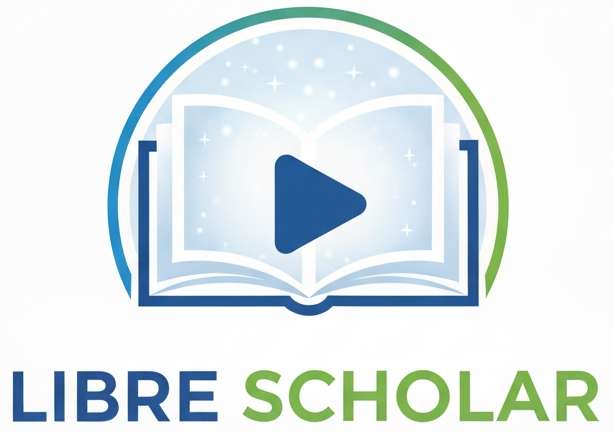

FREE Textbooks mostly from OpenStax. But that's not to say I won't use textbooks from other sources in the future. I have split larger books into parts to make them easier to download. Video lectures to accompany textbooks found here: "https://www.youtube.com/@LibreScholar". <---- IN PROGRESS AS OF 10/25/25
 
 

# By Topic
  > Astronomy [PART1](Astronomy_2e_openstax_1.pdf) [PART2](Astronomy_2e_openstax_2.pdf)  
  > Biology [PART1](Biology_2e_openstax_1.pdf) [PART2](Biology_2e_openstax_2.pdf)  
  > Calculus I [TEXT](Calculus1_openstax.pdf)  
  > Calculus II  [TEXT](Calculus2_openstax.pdf)  
  > Calculus III [PART1](Calculus3_openstax_1.pdf) [PART2](Calculus3_openstax_2.pdf)  
  > Chemistry [PART1](Chemistry_2e_openstax_1.pdf) [PART2](Chemistry_2e_openstax_2.pdf)  
  > Computer Science [TEXT](Introduction_To_Computer_Science_openstax.pdf)  
  > Physics I [PART1](Physics1_openstax_1.pdf) [PART2](Physics1_openstax_2.pdf)  
  > Physics II [TEXT](Physics2_openstax.pdf)  
  > Physics III [TEXT](Physics3_openstax.pdf)  
  > Precalculus [PART1](Precalculus_2e_openstax_1.pdf) [PART2](Precalculus_2e_openstax_2.pdf)

