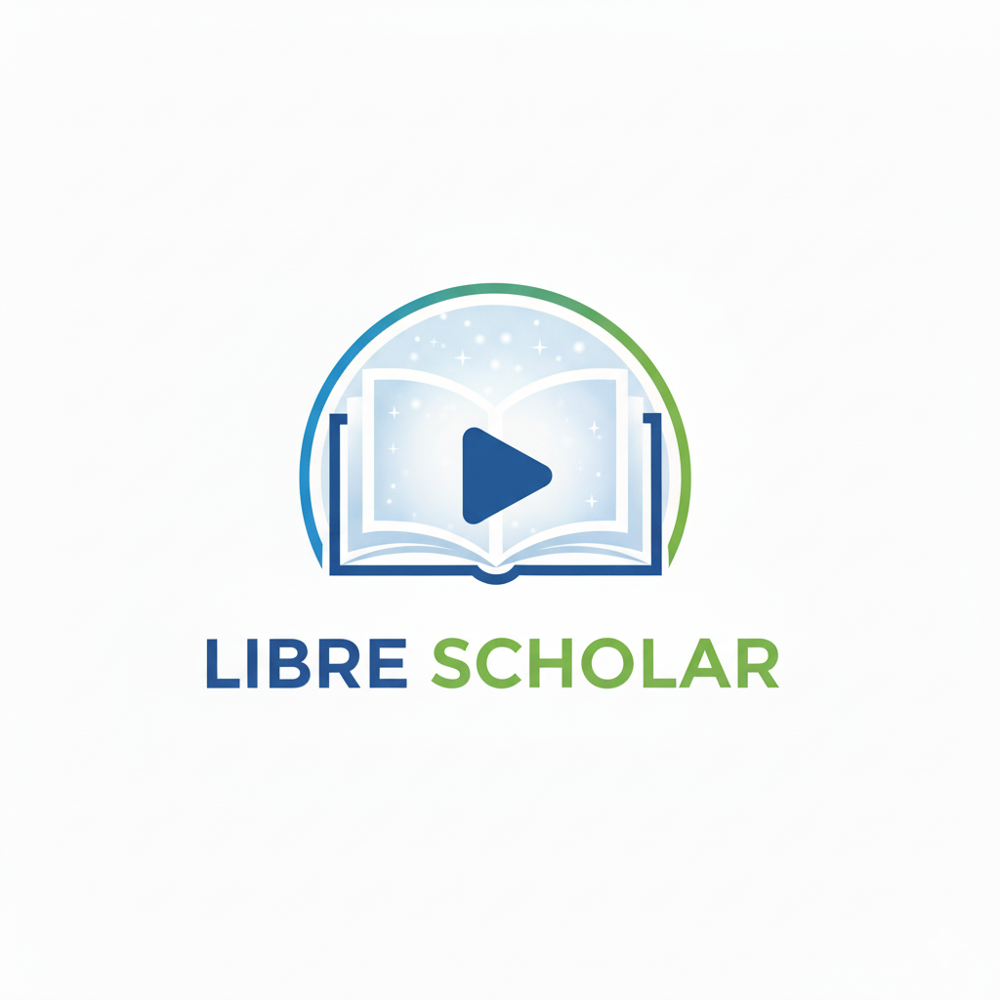

FREE Textbooks used in the Libre Scholar lecture videos. I have split larger books into parts to make them easier to download.
 

 
# Mathematics
  > Precalculus [PART1](Precalculus_2e_openstax_1.pdf) and [PART1.5](Precalculus_2e_openstax_2.pdf)  
  > Calculus [PART1](Calculus1_openstax.pdf) [PART2](Calculus2_openstax.pdf) [PART3]() [PART3.5]()
# Science
  > Physics [PART1]() [PART2]() [PART3]()

